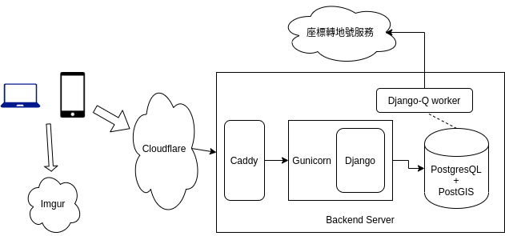

# Disfactory Backend

`Disfactory 違章工廠舉報系統` 的後端。提供給前端的 API 以及一個管理後台

## Architecture



## 跳坑準備

----

當你想跳坑可是又不知道要用什麼姿勢的時候，可以參考下面的連結

### 開發環境

- [Python 3.7](https://www.python.org/)
- [pipenv](https://github.com/pypa/pipenv)
管理 python packages 環境的工具
- [Get Docker](https://docs.docker.com/get-docker/)
- [Install Docker Compose](https://docs.docker.com/compose/install/)
Docker 與 docker-compose 可以協助你快速架設專案所需要的 Database Server

### API Framework

- [Django](https://docs.djangoproject.com/en/2.0/ref/contrib/admin/) - 目前使用 Django 2.x 版本 (最新版本為 3.x)
- [Django REST Framework](https://www.django-rest-framework.org/)

### Database

- [PostgreSQL](https://www.postgresql.org/)
- [PostGIS](https://postgis.net/)

### 專案目前的進度與需求

- [小聚會議記錄](https://g0v.hackmd.io/@yukaii/Disfactory/https%3A%2F%2Fg0v.hackmd.io%2FWS9yFQvmQnmVXH30QiSCjw)
- [Github Issues](https://github.com/Disfactory/Disfactory/issues)

## 設定開發環境

----

以下的環境設定都是以 Mac 與 Linux 為主，
Windows 的話需要使用 WSL2 + Docker Desktop 才有辦法依照下面的步驟設定。

[安裝 WSL2](https://docs.microsoft.com/zh-tw/windows/wsl/install-win10)

[WSL2 + Docker Desktop](https://docs.docker.com/docker-for-windows/wsl/)

### 建立 `.env` 檔

在這個專案 `.env` 檔是非常重要的檔案，因為 `docker-compose` 會使用環境變數設定 container 內的環境變數。
並且 django server 在啟動的時候，也會使用 `python-dotenv` 來讀取 `.env` 檔。

因此在設定開發環境之前，需要建立一個 `.env` 檔，內容如下

```env
DISFACTORY_BACKEND_DEFAULT_DB_NAME=disfactory_data
DISFACTORY_BACKEND_DEFAULT_DB_USER=postgres
DISFACTORY_BACKEND_DEFAULT_DB_PASSWORD=postgres
DISFACTORY_BACKEND_DEFAULT_DB_HOST=db
DISFACTORY_BACKEND_DEFAULT_DB_PORT=5432

DISFACTORY_BACKEND_DEFAULT_DB_DEV_PORT=5433

DISFACTORY_ALLOWED_HOST=localhost,127.0.0.1
DISFACTORY_BACKEND_CORS_ORIGIN_WHITELIST=
DISFACTORY_BACKEND_MAX_FACTORY_PER_GET=50

DISFACTORY_BACKEND_LOG_LEVEL=INFO
DISFACTORY_BACKEND_LOG_FILE=/tmp/disfactory.log

DISFACTORY_BACKEND_DEBUG=true
DISFACTORY_BACKEND_PORT=8888

# will be deprecated
DISFACTORY_IMGUR_CLIENT_ID=your_imgur_id
DISFACTORY_BACKEND_MEDIA_ROOT="./images/"
DISFACTORY_BACKEND_DOMAIN="https://api.disfactory.tw/"
```

也可以直接複製 `.env.sample` 到 `.env`。

最後我們要使用 `.env` 來設定目前的環境變數

( 如果使用 pipenv 或 docker 的話可以跳過這一個步驟，因為 pipenv 會自動讀取 .env 的內容來設定環境變數，而 docker container 啟動時會呼叫 pipenv )

```bash
source .env

# 測試一下，確認環境變數是否正確
> echo $DISFACTORY_BACKEND_DEFAULT_DB_NAME
disfactory_data
```

### 開發環境懶人包 - Docker + docker-compose

如果覺的安裝 Python, pipenv 與 PostgreSQL 等東西很麻煩話，那麼可以選擇完全使用 Docker + docker-compose 作為開發環境。只需要安裝 `Docker` 與 `docker-compose` 就可以快速運行整個後端服務。

安裝方式請參考

- [Get Docker](https://docs.docker.com/get-docker/)
- [Install Docker Compose](https://docs.docker.com/compose/install/)

有安裝 `make` 的話可以直接使用

```bash
make run-dev
```

或使用 docker-compose 指令來啟動

```bash
docker-compose -f docker-compose.dev.yml up -d
```

更詳細的使用方式請看

[Setup with docker-compose](docs/SETUP_COMPOSE.md)

### 在本機上安裝與設定開發環境

### 設定 Python 環境

請確認系統是否有安裝 `Python 3.7`，
如果是 Linux, Mac 或 Windows WSL 環境的話可以使用 [pyenv](https://github.com/pyenv/pyenv) 來安裝特定版本的 Python。

#### 安裝 poetry

osx / linux / bashonwindows install instructions

```bash
curl -sSL https://raw.githubusercontent.com/python-poetry/poetry/master/get-poetry.py | python -
```

windows powershell install instructions

```
(Invoke-WebRequest -Uri https://raw.githubusercontent.com/python-poetry/poetry/master/get-poetry.py -UseBasicParsing).Content | python -
```

詳細可以參考 poetry [poetry](https://python-poetry.org/docs/)

### 設定 PostgreSQL + PostGIS

PostgreSQL 與 PostGIS 有兩種設定方式，可以使用 Docker + docker-compose 啟動 PostGIS 的 Container。
或者是在本機系統上安裝 PostGIS + PostgreSQL Server

#### 使用 Docker + docker-compose

```bash
docker-compose -f docker-compose.dev.yml run --service-ports -d db
```

有安裝 `make` 的話也可以使用 `make run-db` 來啟動

這個指令只會啟動 docker-compose.dev.yml 裡面的 `db` service，並且將 container 的 `5432` port 對應到
`.env` 內的 `DISFACTORY_BACKEND_DEFAULT_DB_DEV_PORT` 指定的 port  ( .env.example 裡面是 5433 )

在 container 啟動之後，還需要設定 `.env` 裡面的 `DISFACTORY_BACKEND_DEFAULT_DB_HOST` 到 `127.0.0.1`。
這樣當你在本機上啟動 django server 的時候，他才能正確的連到 db。

P.S

最好先使用 `make run-dev` 或者 `docker-compose -f docker-compose.dev.yml up -d`
啟動一次所有服務，讓 django 初始化 db 資料，db 才能正常運作。
若 pipenv 有新的套件，為了更新 docker image（不然會用 cache），則需要
`docker-compose -f docker-compose.dev.yml up -d --build --force-recreate`

不然就必須在 db 啟動之後，使用 `python manage.py migrate` 來初始化 db

#### 在本機端上安裝 PostgreSQL + PostGIS

[手動設定 PostgreSQL 與 PostGIS](docs/SETUP_MANUAL.md)

## 啟動 django server

如果想要在本機端啟動 django server 來進行測試的話，可以用下面的指令啟動 django 的測試 server。

```bash
python manage.py runserver
```

## 測試

如果有安裝 `make` 的話，可以使用

```bash
make test
```

來使用 docker 執行所有的 unittest

### API

<https://g0v.hackmd.io/FZFghtuoQ0aaGIl9xXzuKw#API>
